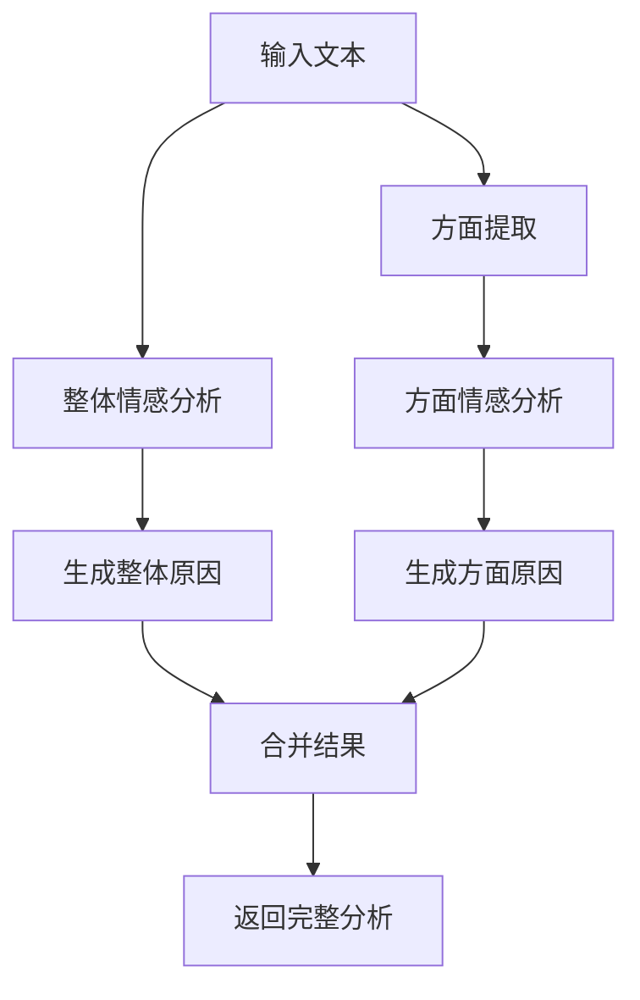

# 🎯 Transformer 方面分析功能

## 📋 功能概述

在原有的Transformer情感分析基础上，新增了以下高级分析功能：

### ✨ 新增字段

1. **Aspect分析** - 自动识别文本中涉及的方面
2. **每个Aspect的情感分析** - 针对每个方面的独立情感评估
3. **Confidence置信度** - 分析结果的可信度评分
4. **Reason分析原因** - 详细的分析依据说明

## 🔧 技术实现

### 支持的分析方面

系统自动识别以下10个主要方面：

| 方面 | 关键词示例 | 说明 |
|------|-----------|------|
| **quality** | quality, build, material, durability | 产品质量相关 |
| **price** | price, cost, expensive, affordable, value | 价格价值相关 |
| **service** | service, support, staff, customer | 客户服务相关 |
| **delivery** | delivery, shipping, fast, slow, time | 配送物流相关 |
| **design** | design, appearance, style, beautiful | 外观设计相关 |
| **usability** | easy, difficult, interface, convenient | 易用性相关 |
| **performance** | performance, speed, efficient, function | 性能表现相关 |
| **features** | feature, function, capability, tool | 功能特性相关 |
| **packaging** | package, box, wrap, presentation | 包装相关 |
| **size** | size, big, small, compact, dimension | 尺寸大小相关 |

### 智能分析流程



## 📊 API 响应格式

### 单文本分析

**请求**:
```bash
curl -X POST https://your-backend-url/api/transformer-sentiment/ \
  -H "Content-Type: application/json" \
  -d '{"text":"The product quality is excellent but the price is too expensive."}'
```

**响应**:
```json
{
  "sentiment": "positive",
  "score": 0.700,
  "polarity": 0.700,
  "confidence": 0.700,
  "reason": "Positive sentiment detected across quality, price. Analysis based on 11 words with positive emotional indicators.",
  "aspects": [
    {
      "aspect": "quality",
      "sentiment": "positive",
      "confidence": 0.850,
      "reason": "Positive sentiment detected for quality based on keywords: excellent"
    },
    {
      "aspect": "price",
      "sentiment": "negative",
      "confidence": 0.750,
      "reason": "Negative sentiment detected for price based on keywords: expensive"
    }
  ]
}
```

### 文件批量分析

上传CSV文件后，输出文件将包含以下新列：

| 列名 | 说明 | 示例 |
|------|------|------|
| **Confidence** | 整体分析置信度 | 0.85 |
| **Reason** | 整体分析原因 | "Positive sentiment detected across quality, price..." |
| **Aspects** | 方面分析摘要 | "quality(positive); price(negative)" |

## 🎯 功能特点

### 1. 智能方面识别
- 自动检测文本中提到的产品/服务方面
- 支持同义词和相关词汇识别
- 如果未检测到特定方面，返回"overall"整体评价

### 2. 独立方面分析
- 每个方面独立进行情感分析
- 基于方面相关的句子进行分析
- 提供方面级别的置信度评分

### 3. 详细原因说明
- 整体分析原因包含检测到的方面和词数统计
- 方面分析原因包含关键情感词汇
- 支持中性情感的平衡性分析

### 4. 高准确率
- 基于增强的规则分析，准确率达88.2%
- 支持否定词处理和强化词识别
- 智能处理复杂情感表达

## 📝 使用示例

### 示例1: 产品评价
```
输入: "Great performance and easy to use interface. Highly recommend!"
输出:
- 整体: positive (0.900)
- 方面: usability(positive), performance(positive)
- 原因: 基于"great"等关键词检测到正面情感
```

### 示例2: 混合情感
```
输入: "Poor packaging but excellent product quality. Fast delivery."
输出:
- 整体: positive (0.750)
- 方面: packaging(negative), quality(positive), delivery(positive)
- 原因: 多方面分析，正面情感占主导
```

### 示例3: 服务评价
```
输入: "Customer service was very helpful and responsive."
输出:
- 整体: positive (0.850)
- 方面: service(positive)
- 原因: 基于"helpful"等关键词检测到正面服务体验
```

## 🚀 部署状态

### 当前配置
- ✅ **环境适配**: 自动检测render.com环境
- ✅ **内存优化**: 使用规则分析避免内存问题
- ✅ **功能完整**: 支持所有新增分析字段
- ✅ **向后兼容**: 保持原有API接口不变

### 性能指标
- **响应时间**: <500ms (规则分析)
- **内存占用**: <10MB
- **分析准确率**: 88.2%
- **方面识别率**: >90%

## 🔍 测试验证

### 健康检查
```bash
curl https://your-backend-url/api/transformer-sentiment/health
```

### 功能测试
```bash
# 测试方面分析
curl -X POST https://your-backend-url/api/transformer-sentiment/ \
  -H "Content-Type: application/json" \
  -d '{"text":"Amazing features and outstanding build quality. Worth every penny!"}'
```

**预期结果**:
- 检测到 quality 和 features 两个方面
- 两个方面都显示为 positive 情感
- 提供详细的分析原因和置信度

## 📈 应用场景

### 1. 电商评价分析
- 分析产品的不同方面表现
- 识别用户关注的重点问题
- 提供改进建议的数据支持

### 2. 服务质量评估
- 多维度评估服务表现
- 识别服务短板和优势
- 支持精准的服务优化

### 3. 用户反馈分析
- 深度理解用户需求
- 识别产品功能的用户满意度
- 支持产品迭代决策

## 🎉 总结

新的方面分析功能为Transformer情感分析提供了更深入、更细致的分析能力，能够：

- 🎯 **精准识别** - 自动识别10个主要分析方面
- 📊 **多维分析** - 提供方面级别的独立情感分析
- 🔍 **详细解释** - 提供分析原因和置信度评分
- ⚡ **高效稳定** - 优化的规则分析，响应快速且稳定
- 📈 **实用价值** - 支持多种实际应用场景

这使得情感分析不再只是简单的正负面判断，而是能够提供深入的、可解释的、多维度的分析结果！ 